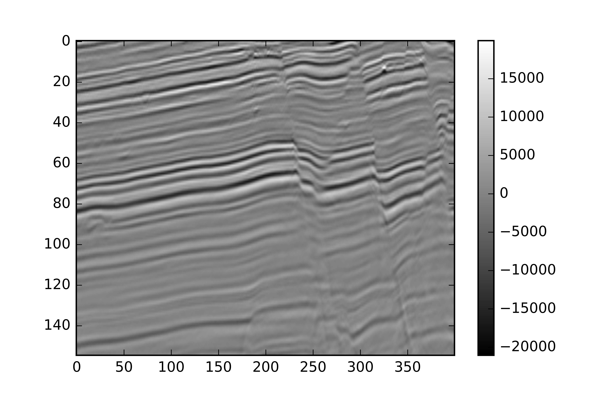

# HorizonTracker 
 

Code for the paper 

### Automatic extraction of dislocated horizons from 3D seismic data using non-local trace matching  
*Aina Juell Bugge, Jan Erik Lie, Andreas Kjelsrud Evensen, Jan Inge Faleide, and Stuart Clark* 
Geophysics, VOL. 84, NO. 6 (NOVEMBER-DECEMBER 2019). Contact: aina.juell.bugge@gmail.com 
 

This repository contains python code and jupyter notebook for data-driven seismic horizon tracking using non-local dynamic time warping and unwrapped instantaneous phase. In order to test the code, we have uploaded a small (<25 MB) seismic survey. To use your own seismic data upload segy data using segyio and name it "seismic_data". 

   *Figure: Available test data with tracked seismic horizons*

Required python packages:  
-- numpy 
-- scipy 
-- matplotlib 
-- skimage 
-- tslearn 
 

### Citation 

For any use this code, please cite the paper this code is based on: "Automatic extraction of dislocated horizons from 3D seismic data using non-local trace matching"
 
 
*Figure from Bugge et al., 2019. The figure shows inline and crossline views for one correlated target horizon in a heavily faulted seismic image from the SW Barents Sea before (a, b) and after (c, d) interpolation. The color bars in (a) and (b) illustrates correlation accuracy.*
