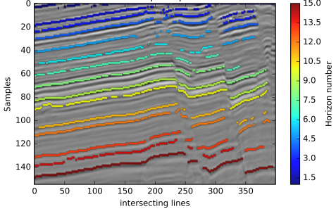

# HorizonTracker 
 
Code for the paper
### Automatic extraction of dislocated horizons from 3D seismic data using non-local trace matching  
*Aina Juell Bugge, Jan Erik Lie, Andreas Kjelsrud Evensen, Jan Inge Faleide, and Stuart Clark* 
Geophysics, 2019. Contact: aina.juell.bugge@gmail.com 
 
This repository contains python code and jupyter notebook for data-driven seismic horizon tracking using non-local dynamic time warping and unwrapped instantaneous phase. The jupyter notebook includes a tutorial with a small seismic survey. 

 

Required python packages:  
-- numpy 
-- scipy 
-- matplotlib 
-- skimage 
-- time 
-- tslearn 
-- IPython.display 
-- sys 
 

Extracting key horizons from seismic images is an important element of the seismic interpretation workflow. Although numerous computer-assisted horizon extraction methods exist, they are typically sensitive to structural and stratigraphic discontinuities. As a result, these computer-assisted methods have difficulties extracting non-coherent dislocated horizons. We present a new data-driven method to correlate, track and extract horizons from seismic volumes with complex geological structures. The proposed method correlates seismic horizons across discontinuities and does not require user input in the form of seed points or prior identification of faults. Furthermore, the method is robust towards amplitude changes along a seismic horizon and does not jump from peak to trough or vice versa. We use a large sliding window and match full-length seismic traces using non-local dynamic time warping to extract grids of correlated points for our target horizons. Through computed accuracy measurements, we discard non-accurate correlations before interpolating complete seismic horizons. Because the proposed method does not require manually picked seed points or prior structural restoration, it does not rely on interpretive experience or geological knowledge.  
 
Figure from Bugge et al., 2019
